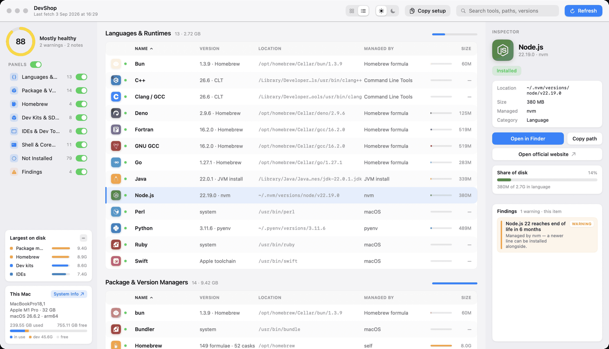
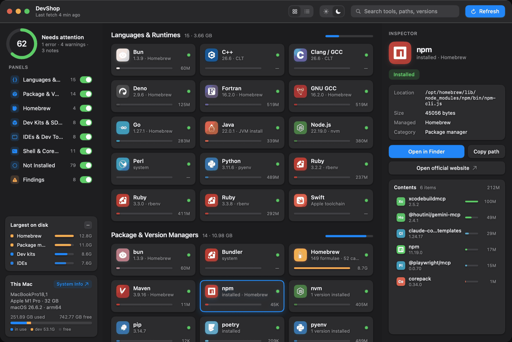
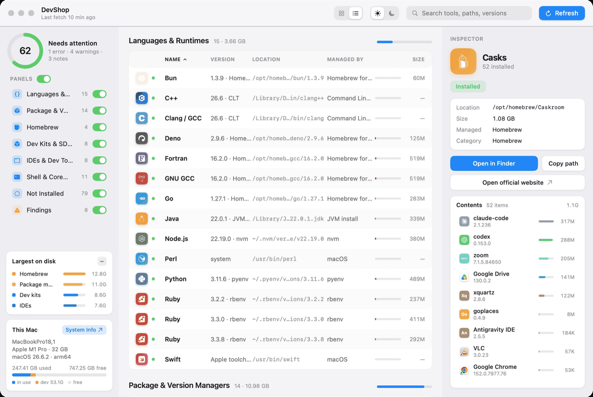
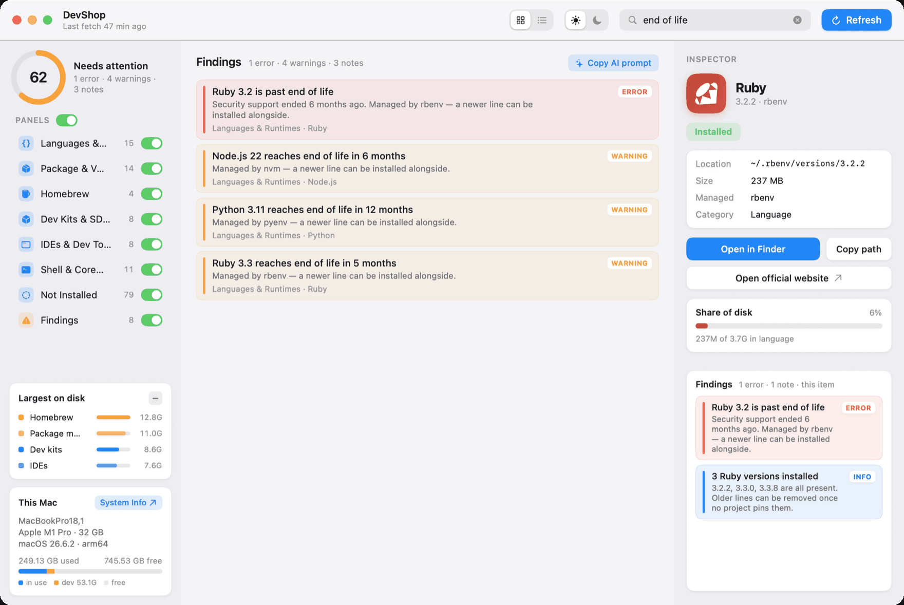

# DevShop

**See every developer tool installed on your Mac — versions, paths, disk usage and what's broken — on one screen.**

A read-only macOS viewer and inspector for your development environment. Free, open source, and fully offline.

[](https://github.com/lucianoarguello335/devshop/releases/latest)
[](https://github.com/lucianoarguello335/devshop/releases)
[](LICENSE)


### [⬇️ Download DevShop for macOS](https://github.com/lucianoarguello335/devshop/releases/latest)

Signed and notarized DMG · macOS 15+ · Universal (Apple Silicon + Intel) · MIT
[Website](https://www.lucianoarguello.dev/apps/devshop/) · [Releases](https://github.com/lucianoarguello335/devshop/releases) · [Design notes](docs/design-notes.md) · [Contributing](CONTRIBUTING.md)



---

**Contents** — [Why](#why) · [What it does](#what-it-does) · [Safety](#safety) · [Requirements](#requirements) · [Install](#install) · [Screenshots](#screenshots) · [FAQ](#faq) · [Contributing](#contributing) · [Design decisions](#design-decisions) · [Layout](#layout) · [Credits](#credits)

---

## Why

You do not actually know what is on your machine. Three Node versions, a Python from 2021, gigabytes
of Homebrew you forgot about, and a PATH line copy-pasted years ago that quietly shadows the runtime
you think you are using. DevShop shows you all of it.

## What it does

- **~137 tools detected** — languages, runtimes, package managers, SDKs, IDEs and CLI tools, with
  real versions and real paths read from Homebrew's Cellar, `Info.plist` files, and nvm/pyenv/rbenv
  version folders. Shows a dash when no file states a version, instead of guessing.
- **Disk usage per tool**, heaviest first, measured on demand and cached.
- **Terminal config inspector** — parses your whole zsh startup chain and lists every PATH entry,
  export, eval hook, alias and function, with the file and line each came from. Also shows which
  terminal emulators are installed.
- **Resolved PATH per shell context** — which `python3`, `node`, `java`… actually runs in a new
  Terminal window versus a shell started inside another one (an editor's terminal, tmux), and
  the line that makes them differ. Worked out from the files; nothing is run.
- **Findings + 0–100 health score** — end-of-life runtimes, stale Homebrew versions, shadowed
  installs, broken PATH entries, plaintext secrets in your shell config.
- **Copy setup (JSON)** — the full scan as sorted JSON that diffs cleanly between machines.
  See a real one: [`docs/example-setup.json`](docs/example-setup.json).
- **Copy AI prompt (⌘⇧C)** — a briefing for an AI agent with exact paths, versions and sizes, so it
  can plan fixes from real data. Secrets stay masked.
  See real output: [`docs/example-ai-prompt.md`](docs/example-ai-prompt.md).

## Safety

- **Never changes anything.** No install, update or removal. Only Open in Finder, Copy path, Open website.
- **Never executes anything.** No subprocesses, no shells. Dotfiles are parsed as text, never sourced.
- **No network access.** End-of-life data ships as a bundled table.
- **Secrets masked** in the UI, in the JSON export, and in the AI prompt.

## Requirements

| | |
|---|---|
| macOS | 15 or later |
| Architecture | Universal — Apple Silicon and Intel |
| Disk | ~10 MB |
| Network | None. DevShop never connects to anything. |
| Account | None. No sign-up, no telemetry. |

## Install

1. [Download the latest DMG](https://github.com/lucianoarguello335/devshop/releases/latest)
2. Open it and drag **DevShop** to Applications
3. Launch it

The app is signed with a Developer ID certificate and notarized by Apple, so it opens on a
double-click with no Gatekeeper detour.

---

## Screenshots





## FAQ

**Is it safe? It reads my dotfiles.**
DevShop parses your shell config as *text* and never executes it. There are no subprocesses, no
shell invocations, and no network calls anywhere in the app. It writes nothing outside its own
Application Support directory. The source is MIT and public — `Sources/DevShop/Scan/` is where all
detection lives, if you want to check.

**Why not just a shell script?**
A script has to run each tool to ask its version, which means a hundred-plus process spawns per
scan and several seconds of waiting. DevShop reads the filesystem instead, so it is near-instant —
and a script cannot show you container contents, disk footprints and shell config in one place.

**It missed a tool on my machine.**
Please tell me. The catalog is a JSON file, so adding a tool is a data edit rather than a code
change — see [CONTRIBUTING.md](CONTRIBUTING.md). Issues and PRs both welcome.

**Why does a tool show a dash instead of a version?**
Because no file on disk states one. DevShop reports what it can read and refuses to guess. Some
tools — jq, oh-my-zsh, powerlevel10k, Rosetta — simply do not record a version anywhere.

**Is it really free? Is there a paid tier?**
Free, MIT licensed, no account, no telemetry, no paid tier.

**Does it work on Intel Macs?**
Yes. The DMG is a universal binary. macOS 15 or later is the only requirement.

**Does it modify or clean up anything?**
No. DevShop is strictly read-only. It tells you what is wrong; fixing it is your call. The
"Copy AI prompt" export exists precisely so an agent can plan the fix with real data — but you
still run it.

## Contributing

The most useful contribution is adding a tool DevShop missed on your machine, and that needs no
Swift — the catalog is a JSON file. See **[CONTRIBUTING.md](CONTRIBUTING.md)** for the entry
format, how to report a detection bug, and the constraints a PR has to respect.

Build and release instructions live there too.

## Design decisions

The decisions that shaped DevShop — and what each one costs — are written up in
**[docs/design-notes.md](docs/design-notes.md)**. The four that matter most to anyone running it:

**Detection is filesystem-only.** Running `node -v`, `brew list` and friends across 137 tools
would mean well over a hundred process spawns per scan. Reading `Cellar/<formula>/<version>`
and `Contents/Info.plist` gives the same versions for almost every tool, instantly, with no
shell involved.

**Sizes are measured on Refresh, not on launch.** Walking `/Applications/Xcode.app` and the
Homebrew Cellar means visiting hundreds of thousands of files. That work runs only when you
press Refresh (and once on a first launch), streams results in as each root finishes, and
persists to `~/Library/Application Support/DevShop/sizes.json` so later launches are instant.

**The startup chain is read, never run.** `Scan/ShellConfigReader.swift` parses the zsh chain
as text — `/etc/zshenv`, `~/.zshenv`, `/etc/paths` and `/etc/paths.d/*`, the two `zprofile`s,
the two `zshrc`s, `~/.zlogin` — and follows `source` exactly one level into files that exist.
Running the dotfiles would give perfect answers and would also execute arbitrary code inside a
read-only inspector, so it does not. The cost is that what a framework defines behind
`source $ZSH/oh-my-zsh.sh`, or what an `eval` prints, is reported as the hook that produces it
rather than as its result — which is the line a user can actually edit anyway. One level is
also where it stops being useful: following every `source` pulls in the three hundred files
oh-my-zsh loads, and a sourced file's own `setopt`s and functions are filtered out for the
same reason.

**Secrets are masked, and stay masked in exports.** A value whose name or shape says
credential is shown as `AIza••••••••••DpdA` with a click-to-reveal in the inspector, raises an
error-tier finding, and is written to the setup JSON and the AI prompt in its masked form
only. A path is never treated as a secret: `SSH_KEY_PATH=~/.ssh/id_ed25519` is a location, and
hiding it would remove the only useful part.

[Read the rest →](docs/design-notes.md)

## Layout

```
Sources/DevShop/
  Model/      ToolDefinition, DetectedTool, Finding, ToolCategory, AppModel,
              ConfigEntry, ShellConfigSnapshot, TerminalApp
  Catalog/    catalog.json — the list of tools and how to find each one
  Scan/       Probes, HomebrewReader, VersionReaders, EnvironmentScanner,
              SizeMeasurer, SizeCache, SystemInfoReader,
              ShellConfigReader, TerminalAppsReader
  Findings/   FindingsEngine, ConfigRules and the offline rule set
  UI/         DevTheme, SVGPath/BrandIcon, TitleBar, Sidebar, Center, Inspector
```

`AppModel` is the single `@MainActor @Observable` source of truth; `EnvironmentScanner` and
`SizeMeasurer` are actors, so nothing touching the filesystem runs on the main thread.

## Diagnostics

To see what the probes found without opening a window:

```bash
DEVSHOP_DUMP=1 ./DevShop.app/Contents/MacOS/DevShop
```

## Changelog

See [Releases](https://github.com/lucianoarguello335/devshop/releases) for what changed in each version.

## Credits

Brand marks come from [Simple Icons](https://simpleicons.org) and are CC0; the trademarks they
depict belong to their respective owners. Interface glyphs use SF Symbols. The app icon is built
from a [uxwing](https://uxwing.com) glyph.

The window layout started as a Claude Design handoff (`DevShop Window.dc.html`) and was built as a
native SwiftUI app.

## License

MIT — see [LICENSE](LICENSE). The bundled Simple Icons path data is CC0 and is
not covered by this license; see Credits above.
